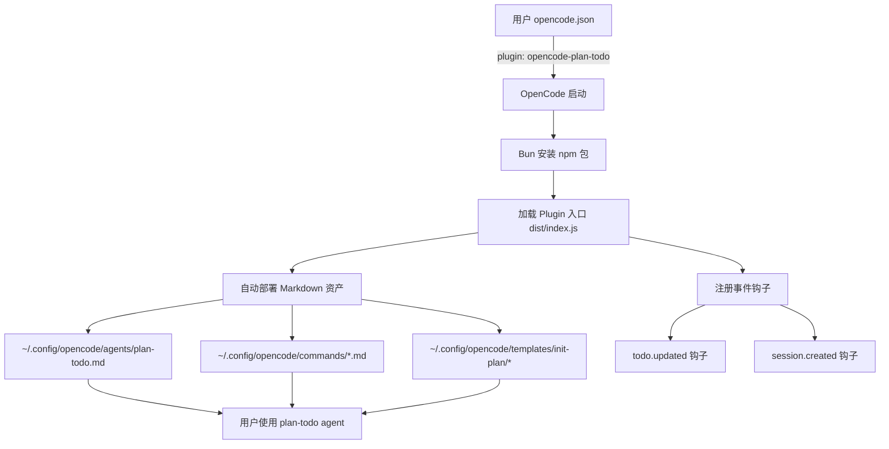

## 用户需求

将 `opencode-plan-todo` 项目从纯 Markdown 配置层改造为 OpenCode npm Plugin 包，完成后推送到远端仓库 `https://github.com/spartawhy117/opencode-plan-todo`，并向 OpenCode 官方生态系统页面提交 PR 以扩大影响力。

## 产品概述

`opencode-plan-todo` 是一个 OpenCode 增强型 planning workflow layer。当前版本（v0.1.1）仅包含 Markdown 形式的 agents/commands/templates，用户需要手动复制文件安装。改造后将成为一个标准的 npm plugin 包，用户只需在 `opencode.json` 中添加一行配置即可使用，同时保留原有的手动安装方式作为兼容。

## 核心功能

1. **npm Plugin 包改造**：新增 `package.json`、TypeScript 入口文件（`src/index.ts`）和构建配置，使项目可通过 `npm i opencode-plan-todo` 安装
2. **Plugin 功能实现**：利用 `@opencode-ai/plugin` API 实现 postinstall 自动部署 agents/commands/templates 到用户的 OpenCode 配置目录
3. **事件钩子增强**：通过 `todo.updated`、`session.created` 等钩子实现 plan 状态监控和日志记录
4. **跨平台安装脚本**：新增 bash 安装脚本，补全 Linux/macOS 支持
5. **文档更新**：更新 README 增加 npm 安装方式，更新 CHANGELOG 记录 v0.2.0
6. **推送到远端仓库**：将所有改造提交并推送到 GitHub
7. **向 OpenCode 官方 ecosystem 提交 PR**：Fork `anomalyco/opencode` 仓库，在生态系统文档中添加 `opencode-plan-todo` 的链接，提交 PR

## 技术栈

- **语言**：TypeScript（Plugin 入口）+ Markdown（Agent/Command 定义，保持不变）
- **运行时**：Bun（OpenCode 原生使用 Bun 管理插件依赖）
- **构建工具**：tsc（TypeScript 编译器，输出到 `dist/`）
- **包管理**：npm（发布到 npm registry）
- **依赖**：`@opencode-ai/plugin`（类型定义，devDependencies）
- **版本管理**：Git + GitHub

## 实现方案

### 整体策略

采用"Plugin 壳 + 配置资产"混合架构：Plugin 入口（TypeScript）负责自动部署和事件钩子增强，而 agents/commands/templates 保持原有 Markdown 格式不变。这种方式：

- 最小化改造成本，不需要把所有逻辑重写为 TypeScript
- 利用 OpenCode 原生的 Markdown agent/command 发现机制
- Plugin 层提供自动安装 + 事件钩子增值能力
- 保留手动安装方式作为兼容

### 工作原理

1. 用户在 `opencode.json` 中配置 `"plugin": ["opencode-plan-todo"]`
2. OpenCode 启动时通过 Bun 自动安装 npm 包
3. Plugin 的 `init` 阶段自动将 agents/commands/templates 复制到用户的全局 OpenCode 配置目录（`~/.config/opencode/`）
4. Plugin 注册事件钩子：监听 `todo.updated` 和 `session.created` 提供 plan 状态日志
5. 用户即可使用 `plan-todo` agent 和所有 `/plan-*` 命令

### 关键技术决策

**决策 1：postinstall 自动部署 vs 纯 Plugin 工具注册**

选择"启动时自动部署 Markdown 资产"而非"把命令全部改写为 Plugin 自定义工具"，原因：

- OpenCode 的 Agent/Command 是 Markdown frontmatter 驱动的，具有丰富的配置选项（description, mode, tools, permission 等），Plugin 的 `tool()` API 无法完全替代
- 保持与手动安装方式的一致性
- 降低改造风险，避免功能回归

**决策 2：事件钩子的范围**

初期仅注册轻量级钩子（日志 + 状态通知），不深度修改 session 行为，原因：

- 避免与用户其他 Plugin 冲突
- Plugin API 的 `experimental.session.compacting` 仍标记为实验性
- 先用最小功能验证 Plugin 架构，后续版本再渐进增强

**决策 3：npm 包的文件发布范围**

通过 `package.json` 的 `files` 字段精确控制发布内容：`dist/`、`agents/`、`commands/`、`templates/`，排除 `docs/`、`scripts/`、`.codebuddy/` 等不必要文件。

## 实现注意事项

1. **跨平台路径处理**：Plugin 中检测 OS，Windows 使用 `%USERPROFILE%/.config/opencode/`，Unix 使用 `~/.config/opencode/`，需使用 `os.homedir()` + `path.join()` 确保兼容
2. **幂等部署**：自动部署逻辑必须幂等——如果目标文件已存在且内容相同，跳过复制；如果用户手动修改了文件，不要覆盖（或提供覆盖选项）
3. **Bun 兼容**：OpenCode Plugin 运行在 Bun 环境下，确保使用 Node.js 标准 API（fs, path, os），避免 Node-only API（如 `fs.cpSync` 在某些 Bun 版本不完整时的问题），使用 `Bun.file()` 等 Bun 原生 API 作为优选
4. **npm 包命名**：使用 `opencode-plan-todo` 作为包名，与仓库名一致
5. **向 OpenCode 生态提交 PR**：需要 Fork `anomalyco/opencode`，在 `docs/` 目录找到 ecosystem 相关文档（可能是 MDX 格式），在 Plugins 分类下新增条目，PR 标题使用 `docs: add opencode-plan-todo to ecosystem plugins`

## 架构设计

### 改造后的模块关系



### 数据流

用户配置 Plugin --> OpenCode 启动加载 --> Plugin init 函数执行 --> 检测并部署资产文件 --> 注册事件钩子 --> 用户正常使用 plan-todo 工作流 --> 事件钩子提供增强日志

## 目录结构

```
opencode-plan-todo/
├── src/
│   ├── index.ts              # [NEW] Plugin 主入口。导出 Plugin 函数，实现：(1) 启动时自动部署 agents/commands/templates 到用户 OpenCode 配置目录 (2) 注册 todo.updated 和 session.created 事件钩子提供 plan 状态日志 (3) 使用 client.app.log() 结构化日志记录部署和运行状态
│   └── deploy.ts             # [NEW] 资产部署逻辑模块。实现跨平台路径解析、文件复制、幂等检查（内容比对避免重复覆盖）。负责将 npm 包内的 agents/commands/templates 目录递归复制到目标配置目录
├── dist/                     # [NEW] 编译输出目录（.gitignore 中排除）
├── package.json              # [NEW] npm 包定义。name: opencode-plan-todo, main: dist/index.js, types: dist/index.d.ts, files 字段包含 dist/ agents/ commands/ templates/
├── tsconfig.json             # [NEW] TypeScript 配置。target: ESNext, module: ESNext, outDir: dist/, strict: true, 适配 Bun 运行时
├── scripts/
│   ├── install.ps1           # [KEEP] 原有 Windows PowerShell 安装脚本
│   └── install.sh            # [NEW] Bash 安装脚本。功能与 install.ps1 对等，支持 Linux/macOS，默认目标 ~/.config/opencode/
├── agents/
│   └── plan-todo.md          # [KEEP] 核心 Agent 定义，不修改
├── commands/
│   ├── init-plan.md          # [KEEP] 不修改
│   ├── plan-feature.md       # [KEEP] 不修改
│   ├── plan-handoff.md       # [KEEP] 不修改
│   └── feature-switch.md     # [KEEP] 不修改
├── templates/
│   └── init-plan/            # [KEEP] 全部模板文件不修改
├── docs/
│   ├── installation.md       # [MODIFY] 新增 npm Plugin 安装方式的说明段落
│   ├── usage.md              # [KEEP] 不修改
│   ├── feature-lifecycle.md  # [KEEP] 不修改
│   └── upgrade-compatibility.md # [MODIFY] 新增 Plugin 模式的升级注意事项
├── README.md                 # [MODIFY] 新增 npm Plugin 安装方式、badge、plugin 配置示例
├── CHANGELOG.md              # [MODIFY] 新增 v0.2.0 版本记录
├── .gitignore                # [MODIFY] 新增 dist/ 排除规则
├── .npmignore                # [NEW] npm 发布时排除 src/、scripts/、docs/、.codebuddy/、.github/ 等非必要文件
└── LICENSE                   # [KEEP] 不修改
```

## 关键代码结构

Plugin 入口接口定义：

```typescript
// src/index.ts
import type { Plugin } from "@opencode-ai/plugin"

export const PlanTodoPlugin: Plugin = async ({ project, client, directory, worktree }) => {
  // 1. 部署资产到 ~/.config/opencode/
  // 2. 返回事件钩子
  return {
    "todo.updated": async (input) => { /* plan 状态日志 */ },
    "session.created": async (input) => { /* 会话创建通知 */ },
  }
}
```

资产部署模块接口：

```typescript
// src/deploy.ts
export interface DeployOptions {
  sourceDir: string    // npm 包内的资产根目录
  targetDir: string    // 用户 OpenCode 配置目录
  force?: boolean      // 是否强制覆盖
}

export async function deployAssets(options: DeployOptions): Promise<DeployResult>
```

## Agent Extensions

### SubAgent

- **code-explorer**
- 用途：在改造过程中探索 OpenCode 主仓库的 docs/ 目录结构，定位 ecosystem 文档的精确文件路径和格式，为提交 PR 做准备
- 预期结果：确认 ecosystem 页面对应的源文件路径（MDX/MD）、现有插件条目格式，确保 PR 内容格式正确